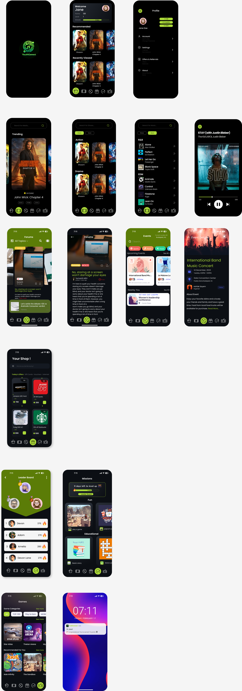

# `YouthConnect` Telecom Rewards and Loyalty Platform

## Full Interface

## Main Idea

**The main idea of the application is that the user can play games, listen to songs and watch movies to get rewards to redeem with items in the store. This encourages the user to use the telecom application even more.**

# Front-End Solution

## Pages

### Launch Page

### **Home Dashboard:**
Displays current points, recent activities, and personalized content.
	- A clean, minimalist layout showing key information (points, recent activities) with vibrant colors and easy-to-read fonts.
	- **Personalized Offers:** A dynamic section that changes based on user preferences, with clear and enticing visuals.
#### Features: 
- Here the user can view the the recommended and personalized media content (songs and shows)
- Here the user can see top status bar of the user current progress as in points and streaks. a progress bar for the streaks from 1 to 30. 
- Here the user can see Recently Played

### **Profile and Settings Page:** 
- **Profile and Settings:** Intuitive navigation and easy access to customization options.
- Users earn points for using telecom services, like data usage, call minutes, etc. Where users can customize their preferences, manage account settings, etc.
- **Points System and Rewards Catalogue:** A gamified interface with interactive elements for browsing and redeeming rewards.

### **Game Page**: 
A page where users can see games they can play and get points to redeem. 

### **Media Page**:
Show media content like movies and series for the user. 

#### Trending

### Shows

### Music

### Media Player Page

### **Store:**
- A section where users can browse and redeem points for rewards like data packs, call minutes, merchandise, etc.

### **Missions:**
- Users participate in challenges to earn extra points.
	- **Challenges:** An engaging section with progress bars, achievement badges, and interactive challenges.

### **Leaderboard:**
Highlighting active community members.

### **Notifications:** 
- Alerts for new rewards, challenges, or special offers.
- **Notifications:** Non-intrusive yet noticeable alerts.
  
  
### **Events Page**: 
A page where the user can see a lot of event nearby

### **Forums:**
A platform for users to share their own content, like blogs or videos.

# Back-End Solution
## Tech 
- The database is created using Neo4j.  
- The API is implemented using Next.js built on React.js
## Database Design
### Neo4j Modeling

# Database Design
## User
## UserSession
## UserPreferences
## Media
## MediaSession
## Comment
## Game
## GameSession
## StoreItem
## Balance
## DailyMission
## Song
## Show
## Blog

## Relationships

## Entities : 

### User -- HAS_USERPREFERENCES --> USERPREFERENCES
### User -- HAS_COMMENT --> COMMENT
### User -- HAS_REACTION_ON_SONG --> Song
### User -- HAS_REACTION_ON_SHOW --> Show
### User -- HAS_GAMESESSION --> GAMESESSION
### User -- HAS_MEDIASESSION --> MEDIASESSION
### User -- HAS_USERSESSION --> USERSESSION
### User -- IS_ASSIGNED_DAILYMISSION --> DailyMission

### GameSession -- PLAYED_ON --> Game
### MediaSession -- STARTED_ON_SONG --> Song
### MediaSession -- STARTED_ON_SHOW --> Show
### Comment -- COMMENTED_ON_SONG --> Song 
### Comment -- COMMENTED_ON_SHOW --> Show 

# Endpoints For Pages
### User Management
1. **POST /users/register
2. **POST /users/login
3. **GET /users/{userID}
4. **PUT /users/{userID}
5. **DELETE /users/{userID}

### User Preferences
6. **GET /preferences/{userID}
7. **POST /preferences/{userID}
8. **PUT /preferences/{userID}

### Session Management
9. **POST /sessions/start
10. **POST /sessions/end
11. **GET /sessions/{sessionID}

### Media Management
12. **GET /media
13. **POST /media
14. **GET /media/{mediaID}
15. **PUT /media/{mediaID}
16. **DELETE /media/{mediaID}

### Game Management
17. **GET /games
18. **POST /games
19. **GET /games/{gameID}
20. **PUT /games/{gameID}
21. **DELETE /games/{gameID}

### Balance and Rewards
22. **GET /balance/{userID}
23. **POST /balance/update
24. **GET /store/items
25. **POST /store/purchase

### Daily Missions
26. **GET /missions
27. **POST /missions
28. **GET /missions/{missionID}
29. **PUT /missions/{missionID}
30. **DELETE /missions/{missionID}

### Comments and Interactions
31. **POST /comments
32. **GET /comments/{mediaID}
33. **DELETE /comments/{commentID}

### Leaderboard and Achievements
34. **GET /leaderboard
35. **GET /achievements/{userID}

### Notifications
36. **GET /notifications/{userID}
37. **POST /notifications/send

### Event Management
37. **GET /events
38. **POST /events
39. **GET /events/{eventID}
40. **PUT /events/{eventID}
41. **DELETE /events/{eventID}

### Forums
42. **GET /forums/posts
43. **POST /forums/posts
44. **GET /forums/posts/{postID}
45. **PUT /forums/posts/{postID}
46. **DELETE /forums/posts/{postID}

# Skteches

